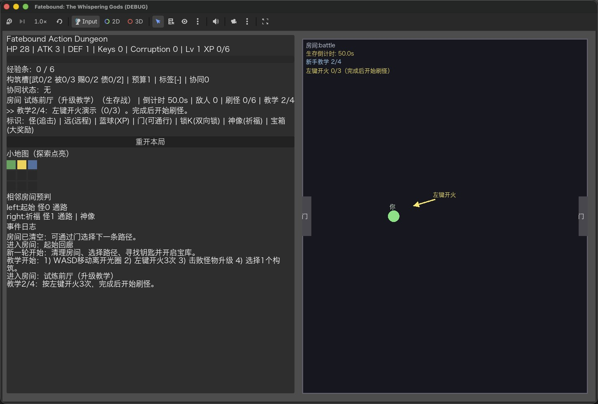
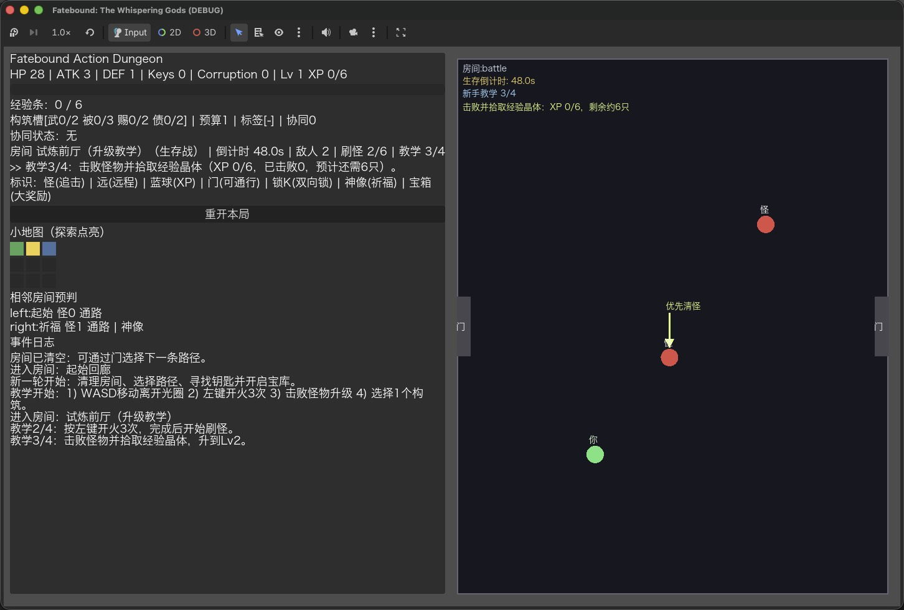
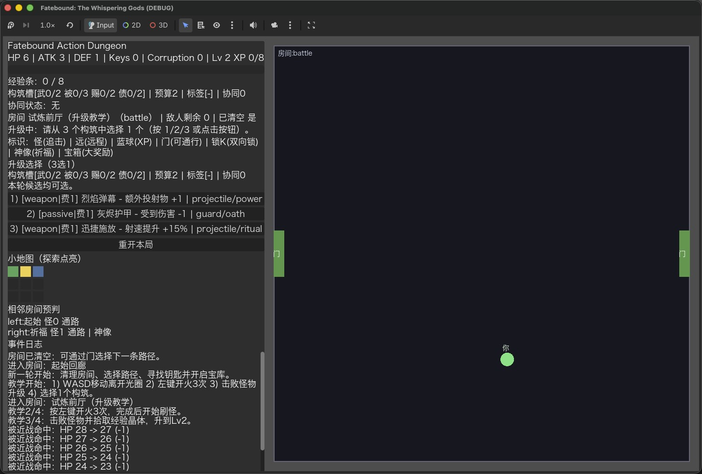
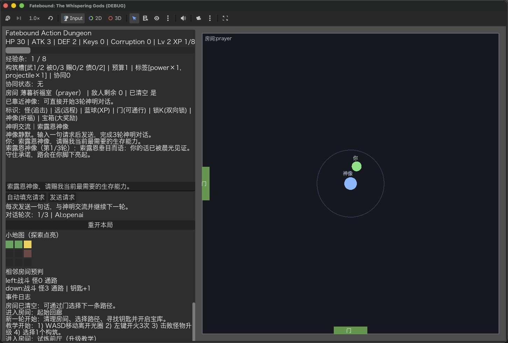
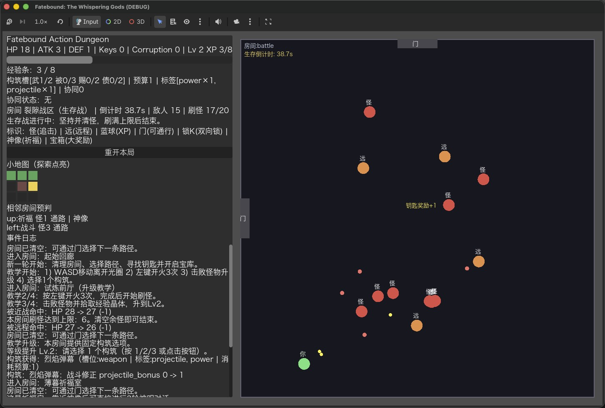
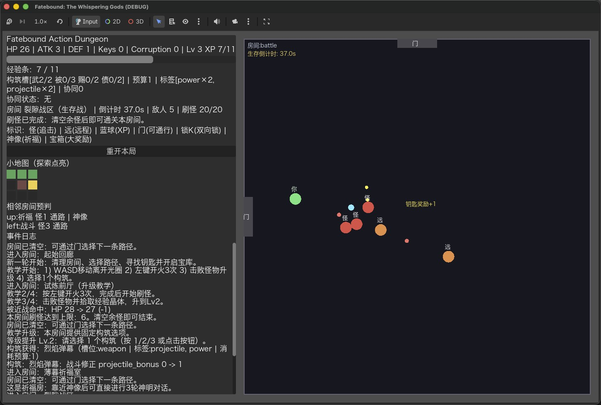

# Fatebound: The Whispering Gods

AI 驱动 Roguelike 原型  
规则优先（Rules-First）系统架构设计  
单机可复现 · JSON 数据驱动 · AI 与数值解耦

## 30 秒读懂项目

- 这是一个以“自然语言祈祷”为核心交互的动作 Roguelike 原型。
- 玩法目标是把“语言交互”与“数值构筑”整合到同一条循环中。
- 设计重点不是“让 AI 决定数值”，而是“用 AI 承载意图与叙事，规则系统控制平衡”。

## 核心玩法概念

玩家在地牢中战斗与探索，并通过自然语言向神明祈祷以换取增益或承担代价。

- 玩家输入愿望
- AI 解析意图
- 规则引擎执行数值判定
- AI 生成叙事反馈

> AI 不参与数值与奖励计算。所有 Buff / 诅咒 / 资源变动均由规则系统决定。

## 核心设计原则

- `Rule Engine = 唯一真相来源`
- `AI = 意图解析 + 叙事表达`
- 奖励/诅咒/状态变化全部由 JSON 规则驱动
- 支持 deterministic replay（同 seed、同输入、同选择可复现）
- 支持 headless 自动测试

## 系统架构图

```text
Player Input
    ↓
Intent Parser (AI Gateway)
    ↓
Rule Engine (JSON/CSV)
    ↓
Reward / Curse / State Change
    ↓
Narrative Generator (AI Gateway)
    ↓
Player Feedback
```

## 核心循环

探索 -> 战斗 -> 清房 -> 祈福 -> 规则结算 -> 构筑变化 -> 终局

## 玩法截图

以下为当前可运行 MVP 的实机截图（教学、战斗、构筑、祈福流程）。

| 教学引导开局 | 战斗与清怪 | 升级三选一 |
| --- | --- | --- |
|  |  |  |

| 祈福房交互 | 生存战斗中盘 | 生存战斗清场 |
| --- | --- | --- |
|  |  |  |

---

## 项目状态

- 状态：`可运行白盒 MVP（Action Dungeon 模式）`
- 引擎：`Godot 4.6`
- 默认入口：`res://scenes/DungeonRun.tscn`
- 核心原则：`Rules-First`（规则与数据驱动，AI 仅做意图/叙事）
- 当前约束：`Fate 字段已冻结并隐藏（不再提供选项，也不参与数值结算）`

---

## 当前可玩内容

1. 房间探索循环（起始/战斗/祈福/宝库）。
2. 实时移动与射击（WASD + 鼠标左键）。
3. 生存战斗房支持刷怪上限，刷满后清空余怪即可结算。
4. 清房后通门，带锁路径需钥匙解锁。
5. 祈福房交互：
   - 必须先清怪。
   - 必须靠近神像。
   - 输入请求时角色移动冻结。
   - 完整流程：固定 3 轮神明对话 -> 每轮规则结算。
   - 神明祝福可提供战斗效果（射速、穿透、暴击等）。
   - 对话请求中显示"神明回应中..."加载动画。
6. 教学关（`r01`）操作引导闭环：
   - 分步骤引导：移动 -> 开火 -> 击杀升级 -> 选择构筑。
   - 世界空间动态箭头 + UI 脉冲提示。
   - 固定构筑选项与“刚好升 1 级”刷怪量。
7. 构筑系统 v2（Phase 2B 第二版）：
   - 槽位限制：`weapon/passive/godsend/debt`。
   - 预算进阶：`tier_cost` + 每级预算增长 + 前置标签约束。
   - 标签协同：满足 `synergy_rules` 后触发额外效果。
   - VS 风格战斗效果：穿透、暴击、吸血、经验加成、磁吸范围、子弹体积。
   - 升级面板显示槽位与标签，日志输出协同激活来源。
8. 怪物死亡掉落经验晶体，角色靠近后自动吸附拾取；HUD 显示经验条。
9. 刷怪全局调参系统：
   - `global_tuning` 统一控制刷怪频率、怪物强度与后期怪海压力。
   - 支持单点调参影响整体战斗节奏，便于数值平衡迭代。
10. 小地图探索点亮 + 相邻房间有限预判。
11. 日志持续输出战斗、解锁、祈福、结算事件。
12. 战场可视区域会按左侧 HUD 动态让位，避免文字被遮挡。
13. AI Provider 支持 `stub/openai` 切换（当前仓库配置默认 `openai`），`openai` 异常自动降级离线流程。

---

## 技术栈

- Godot 4.x + GDScript
- CSV/JSON 配置（CSV 优先，JSON 兼容回退）
- Rules-first 架构：
  - 规则层决定数值与效果。
  - AI/stub 层仅做意图 JSON 与叙事文本。

---

## 配置编辑（CSV 优先）

运行时会优先读取 `res://data/csv/*.csv`，缺失时自动回退到 `res://data/*.json`。

- 构筑配置：
  - `data/csv/build_nodes_nodes.csv`
  - `data/csv/build_nodes_synergy_rules.csv`
  - `data/csv/build_nodes_slot_limits.csv`
  - `data/csv/build_nodes_progression.csv`
- 刷怪配置：
  - `data/csv/spawn_profiles.csv`
  - `data/csv/spawn_global_tuning.csv`

CSV 更新后无需改代码，直接运行场景即可生效。

神明对话与 AI 配置：
- `data/dialogue_config.json`（固定轮次、每轮 reward/curse 曲线、建议模板）
- `data/ai_provider.json`（`stub/openai`、模型、超时、schema）
- `data/prompts/*.prompt.txt`（每位神明独立 prompt，可直接改说话风格）
- `data/dialogue_config.json` 中 `show_rule_logs=false` 时，神明对话不会输出技术结算日志。

---

## 快速运行

### GUI 运行

```bash
/Applications/Godot.app/Contents/MacOS/Godot --path .
```

### API 检测场景（OpenAI）

```bash
/Applications/Godot.app/Contents/MacOS/Godot --path . --scene res://scenes/tools/AIApiProbe.tscn
```

### Headless 启动校验

```bash
/Applications/Godot.app/Contents/MacOS/Godot --headless --path . --scene res://scenes/DungeonRun.tscn --log-file ./godot-scene.log --quit
```

### 测试（规则层）

```bash
/Applications/Godot.app/Contents/MacOS/Godot --headless --path . -s res://scripts/tests/run_tests.gd --log-file ./godot-tests.log
```

### 测试（AI Provider 降级）

```bash
/Applications/Godot.app/Contents/MacOS/Godot --headless --path . -s res://scripts/tests/test_dialogue_ai_gateway.gd --log-file ./godot-gateway-test.log
```

---

## 操作说明

- `WASD` / 方向键：移动
- `鼠标左键`：射击
- 清空房间敌人后，移动到门口切换房间
- 祈福房中，靠近神像后可输入祈祷请求并选择祝福
- 教学关会显示步骤化指引与箭头动画，按提示完成即可学会升级

---

## 项目结构

详细结构与职责见：`docs/PROJECT_STRUCTURE.md`

顶层目录：

- `scenes/`：场景资源（当前主场景 `DungeonRun.tscn`）
- `scripts/`：玩法逻辑、规则引擎、测试
- `data/`：房间/神明/奖励/诅咒等 JSON 数据
- `docs/`：方案、重构说明与项目文档
- `skills/`：本地 Codex 技能（当前含 `docs-sync-and-commit`）
- `assets/`：字体与美术素材

---

## 文档导航

- `docs/PROJECT_STRUCTURE.md`：当前项目构成、模块职责、运行与测试入口
- `docs/DUNGEON_RUNTIME_REWORK.md`：动作地牢运行时重构与现状
- `docs/ACTION_DUNGEON_MVP_PLAN.md`：动作化 MVP 计划
- `docs/BUILD_ROUTE_AND_ENDINGS.md`：完整构筑路线与结局定义（Demo）
- `docs/DEITY_COMMUNION_SYSTEM_SPEC.md`：神明三轮对话系统规格（待补充更新）
- `docs/GAME_DESIGN_DOCUMENT.md`：设计文档（GDD）
- `docs/PROJECT_BRIEF.md`：项目简述
- `docs/AI_FEASIBILITY_ANALYSIS.md`：AI 可行性分析
- `docs/ENGINE_COMPARISON.md`：Godot 与 UE5 对比

---

## 系统策划能力体现

- 规则优先设计：把平衡性与可控性放在系统中心，降低 AI 黑盒风险。
- 数据驱动结构：核心规则与参数外置，支持快速迭代与版本对比。
- 数值与叙事解耦：AI 负责意图/反馈，规则负责结果，职责边界清晰。
- 可测试架构：headless + 自动测试覆盖关键规则流程，支持回归验证。
- 可调参数统一入口：通过全局调参点控制战斗节奏，提升调优效率。

---

## 版本管理

- 已使用 Git 管理项目。
- 建议每个可运行阶段单独提交，提交信息遵循：`feat/fix/docs/test: 摘要`。
